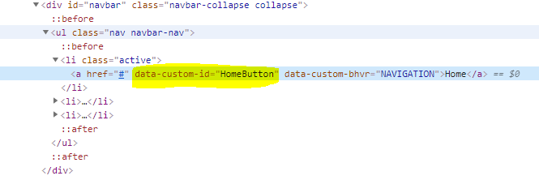
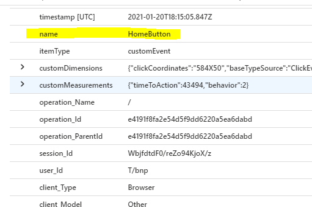
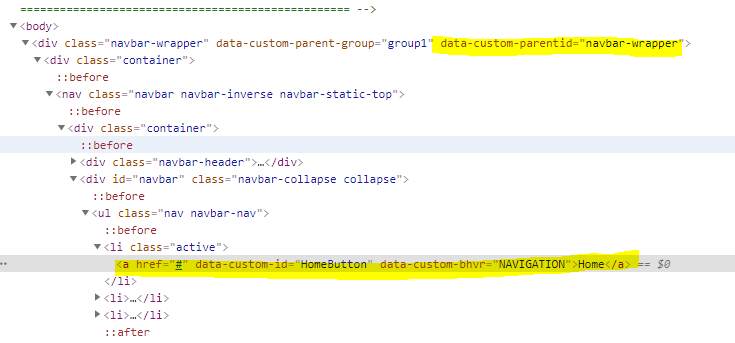
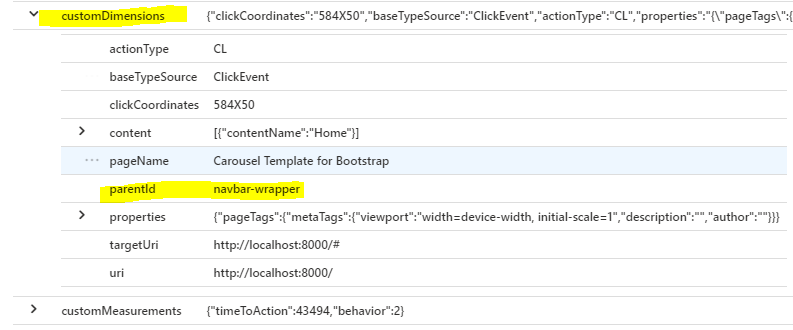
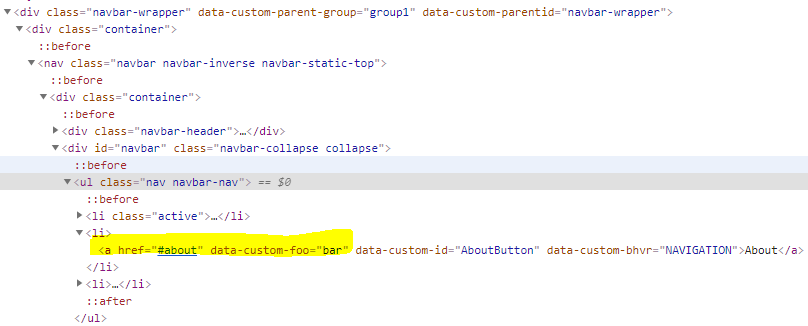
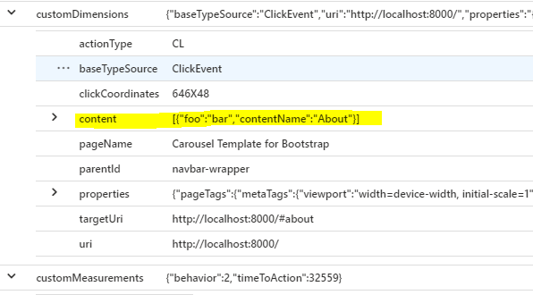
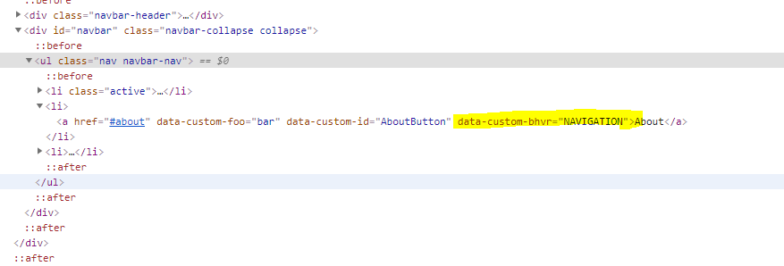
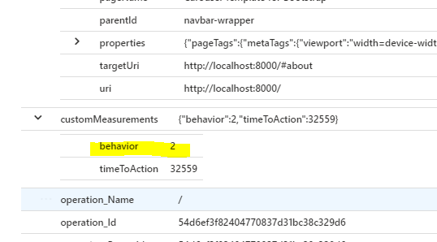

# Application Insights JS with Click Analytics Plugin - HTML sample

This is a simple HTML/CSS/JS web app that illustrates how to enable Application Insights Click Analytics Plugin

It is built on the [Carousel template](http://getbootstrap.com/examples/carousel) by [Bootstrap](http://getbootstrap.com).

## Pre-requisites 

1. [Git](https://docs.microsoft.com/en-us/azure/devops/learn/git/install-and-set-up-git) and [Node.js](https://docs.microsoft.com/en-us/windows/nodejs/setup-on-windows) installed on your computer.
2. Familiarity with editing text and code files in any text editor.

## Get Started

1.  Create an Application Insights resource in Azure by following [these instructions](https://docs.microsoft.com/en-us/azure/application-insights/app-insights-javascript?toc=/azure/azure-monitor/toc.json).

2.  Open terminal and clone the repo using `git clone` 

3.  Grab the Instrumentation Key (aka "ikey") from the resource you created in step 1. Later, you'll add it to the instrumentationKey setting in the `public/ts/appinsights.ts` file

4.  In the project directory you should run `npm install` on your terminal to install all the dependencies.

5.  After making the changes in step-3, please run `npm run build` on your terminal to transpile and browserify the `appinsights.ts` file

6.  To launch the app locally , simply run the following command on your terminal

    `node index.js`

7. 	Open your favorite browser and go to http://localhost:8000/


## Correlating HTML tags with telemetry data.

### How to see the telemetry data generated?

1. Please go to Application Insights instance in the Azure portal.
2. On the left hand side of the portal , looking for 'Logs' unders the 'Monitoring' section. Double-click to open 'Logs'
3. Run a simple [Kusto](https://docs.microsoft.com/en-us/azure/data-explorer/kusto/concepts/) query to fetch the latest records from the 'customEvents' table as shown below(change the date accordingly): 
```
customEvents
| where timestamp > datetime(2021-01-20) and timestamp < datetime(2021-01-21)
``` 
### Custom Event 'Name'

Following is an example illustrating how the click event on 'Home' button has generated a new record with `name` 'HomeButton' in 'customEvents' table of Application Insights.


<br/>


### Custom Event 'parentId'

Following is an example illustrating how the click event on 'Home' button has generated a new record with `parentId` 'navbar-wrapper' in 'customEvents' table of Application Insights.


<br/>


### Custom Event with custom data in 'content'

Following is an example illustrating how the click event on 'About' button has generated a new record with `content` values {"foo"="bar"} in 'customEvents' table of Application Insights.


<br/>


### Custom Event 'behavior'

Following is an example illustrating how the click event on 'About' button has generated a new record with `behavior` value '2' in 'customEvents' table of Application Insights.

> If you are wondering how 'Navigator' in html event translated to '2' in Kusto table, `BehaviorMapValidator` which took the `behaviorMap` as input has done this mapping. 


<br/>
